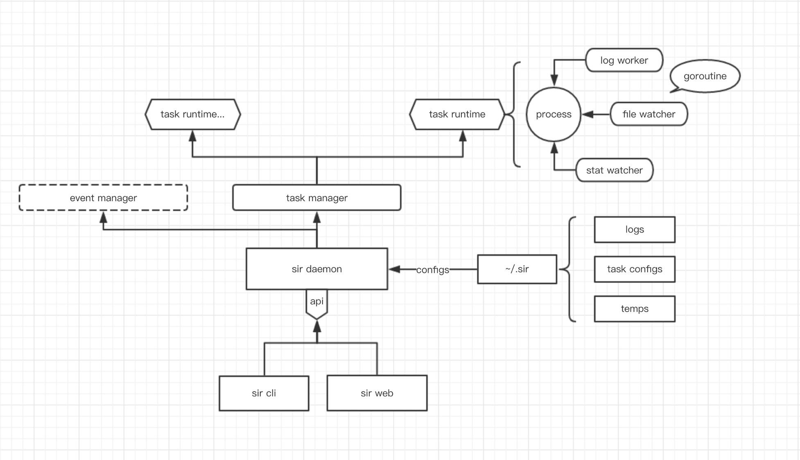

# sir

An awesome process manage tool which inspired by supervisor & pm2.

## Design
 


## Usage
```
   ___________
  / __/  _/ _ \
 _\ \_/ // , _/
/___/___/_/|_|    v0.0.1


Sir - May I help you?


Usage: sir [global options] command [command options] [arguments...]


Commands:

  > Config Management:
    add <cmd> --name <taskname>  create a task config by params
    remove <task>                remove a task config by name
    update <task>                update task configs with default editor

  > Service Management:
    kill                                                    kill sir daemon process
    status                                                  show sir daemon detail status
    statistics [<task>] [-from <fromtime>] [-to <endtime>]  show statistics, default sir daemon statistics

  > Task Management:
    start <task>                     start and daemonize a task
    stop <task>                      stop a task (to start it again, do sir restart <task>)
    restart <task>                   restart a task
    list                             list all tasks
    show <task>                      describe all parameters of a task
    attach <task>                    attach stdin & stdout to a task process
    log <task> [--type "err"|"std"]  stream task logs. default is std log


Global Options:

  --host value, -s value  specify the daemon server address
  --help, -h              show help
  --version, -v           print the version
```